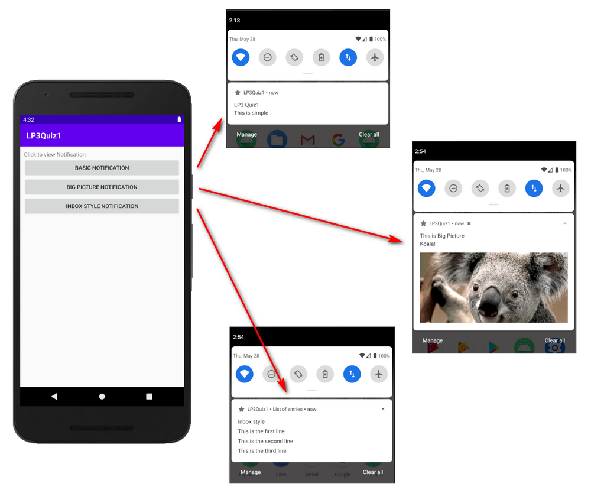
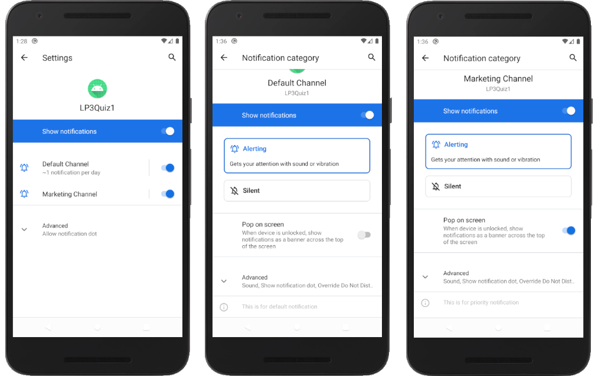

# Practical Quiz for Learning Package 3

This document outlines the information of the Practical Quiz.

This repository contains the skeleton code for the quiz.

### Structure of the quiz
There are 2 parts to this quiz, to be released at different timing:

1. After lesson 6
2. After lesson 7

### Content of the quiz (Part 1 - released after Lesson 6)

#### Prelude

In the world of open source, there are many public repositories hosted in GitHub, waiting for someone to contribute.

To contribute to a public repository, the access rights to it determines the methods:

| Scenario | Description                                                                         |Access rights                   |
|:---------|:------------------------------------------------------------------------------------|:-------------------------------|
| 1        | a contributor (meaning you are added to the repository to be a contributing member) |Granted write access to the repo|
| 2        | a good samaritan, wanted to contribute to the repo on an adhoc basis                |No write access granted to repo |

#### The tasks

This repository contains an incomplete Android app project. You are required to complete this app, as shown below.

Basically, there will be 3 buttons to launch different notifications.

At the same time, the Android app has 2 Notification channels, as shown in the App info below:

#### How to start it off?

1. You must fork this repository (https://github.com/C347-2020/LP3-XXXX) using a web browser (I'm not going to add you as a contributor, so it's scenario (b) )
2. <b>Clone/Check-out</b> your fork version of this repository (https://github.com/your_username/LP3-XXXX) using Android Studio (find it in your own GitHub account!)
3. Create a <b>branch</b>, make changes → commit to the created branch → then push (reminder: push to your fork version, not this!)
4. A good practice, check if the push is successful, using a web browser (here: https://github.com/your_username/LP3-XXXX)
5. Create a pull request, to get your inserted code to this repository. For example, something like this:

6. Done. You can check if the pull request has been created here (https://github.com/C347-2020/LP3-XXXX).

*<b>Note</b>: If you happen to mess up your repository, just delete and fork it again :)

#### Resources:

- https://www.androidauthority.com/github-git-tutorial-995047/ (This is a good read, overview on Git & GitHub)
- https://www.youtube.com/playlist?list=PLlNpLMtnWblDyU14hzp40Fa6ZKDJ9UJsJ
- https://help.github.com/en/github/collaborating-with-issues-and-pull-requests/creating-a-pull-request-from-a-fork

### Requirement for submission

You are to work on the designated repository (in which, this is the one).

You are required to push your code into your repository regularly and GitHub will do the necessary code tracking.

| Parts                       | Deadline                                                       |
|:----------------------------|:---------------------------------------------------------------|
| Lesson 6 - LP Quiz 3 Part 1 | Tasks completed before Lesson 7                                |
| Lesson 7 - LP Quiz 3 Part 2 | Pushed into repository by 2359 of the following day of Lesson7 |

In any case, the deadline for the overall quiz submission is 2359 of the following day of Lesson 7.

## Plagiarism Warning

In essence, what you submit is your own work, without help from others in anyway (unless cited in the submission).

Refer to the link below, if you need more info.  
<http://intranet.rp.edu.sg/sites/StudentHandbook/SitePages/summative_assessment_rules_and_regulations.aspx>

## Academic Integrity

#### Writing Code

Writing code is similar to academic writing in that <b>when you use or adapt code developed by someone else as part of your project, you must cite your source.</b> However, instead of quoting or paraphrasing a source, you include an inline comment in the code. These comments not only ensure you are giving proper credit, but help with code understanding and debugging.

Src: https://integrity.mit.edu/handbook/writing-code
